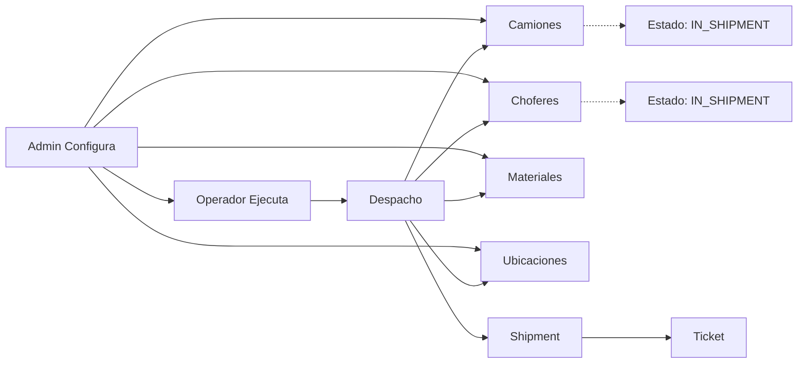
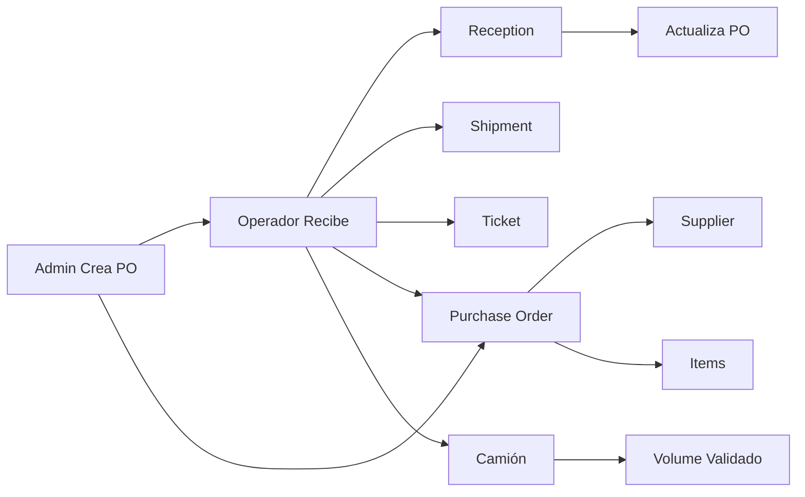

# Comparación de Flujos: Admin vs Operador - Acarreo.mx

## Resumen Ejecutivo

Este documento compara los flujos de datos y operaciones entre el panel de administración (`/admin`) y el módulo de operador (`/operator`) para identificar consistencias, diferencias y oportunidades de mejora.

## Mapeo de Entidades Compartidas

### Colecciones de Firestore Utilizadas

| Entidad | Colección | Admin | Operador | Consistencia |
|---------|-----------|-------|-----------|--------------|
| Camiones | `trucks` | ✅ | ✅ | ✅ Completa |
| Choferes | `drivers` | ✅ | ✅ | ✅ Completa |
| Materiales | `materials` | ✅ | ✅ | ✅ Completa |
| Ubicaciones | `locations` | ✅ | ✅ | ✅ Completa |
| Envíos | `shipments` | ✅ | ✅ | ✅ Completa |
| Tickets | `tickets` | ✅ | ✅ | ✅ Completa |
| Órdenes Compra | `purchase_orders` | ✅ | ✅ | ✅ Completa |
| Operadores | `operadores` | ✅ | ❌ | ⚠️ Inconsistente |
| Transportistas | `transportistas` | ✅ | ❌ | ⚠️ Inconsistente |

## Análisis por Entidad

### 1. Camiones (Trucks)

**Admin:**
- Modelo completo con todos los campos requeridos
- Gestión de CRUD completo
- Estados: AVAILABLE, IN_SHIPMENT

**Operador:**
- Solo utiliza campos básicos (id, plate, model, volume, status)
- Solo lectura y actualización de estado
- No puede crear/editar camiones

**Consistencia:** ✅ **Adecuada**
- El operador solo necesita los campos necesarios para operaciones
- La gestión completa corresponde al admin

### 2. Choferes (Drivers)

**Admin:**
- Modelo completo con información de contacto
- Gestión de CRUD completo
- Estados: AVAILABLE, IN_SHIPMENT

**Operador:**
- Solo utiliza campos básicos (id, name, status)
- Solo lectura y actualización de estado
- No puede crear/editar choferes

**Consistencia:** ✅ **Adecuada**
- Separación de responsabilidades correcta

### 3. Materiales (Materials)

**Admin:**
- Modelo completo con clasificaciones y unidades
- Gestión de CRUD completo
- Relaciones con clasificaciones

**Operador:**
- Solo lectura de materiales
- Utiliza name, unit para display
- No puede crear/editar materiales

**Consistencia:** ✅ **Adecuada**
- El operador solo necesita seleccionar materiales existentes

### 4. Ubicaciones (Locations)

**Admin:**
- Modelo completo con dirección y coordenadas
- Gestión de CRUD completo

**Operador:**
- Solo lectura de ubicaciones
- Utiliza name para selección en despachos/entregas

**Consistencia:** ✅ **Adecuada**
- El operador solo necesita seleccionar ubicaciones existentes

### 5. Envíos (Shipments)

**Admin:**
- Vista completa de todos los envíos
- Filtros y búsqueda avanzada
- Actualización manual de estados

**Operador:**
- Creación automática al despachar
- Actualización automática al entregar
- Solo puede ver/enviar los que le corresponden

**Consistencia:** ✅ **Adecuada**
- Flujo consistente con reglas de negocio

### 6. Tickets

**Admin:**
- Vista completa de todos los tickets
- Gestión y consulta
- Diferentes tipos (dispatch, delivery, reception)

**Operador:**
- Creación automática al realizar operaciones
- Solo puede ver los que genera
- Redirección automática después de crear

**Consistencia:** ✅ **Adecuada**
- Cada ticket está asociado a su operación específica

### 7. Órdenes de Compra (Purchase Orders)

**Admin:**
- Gestión completa de órdenes
- Creación y seguimiento
- Control de proveedores

**Operador:**
- Solo lectura de órdenes pendientes
- Filtradas por ubicación actual
- Solo puede procesar recepciones

**Consistencia:** ✅ **Adecuada**
- El operador solo ejecuta recepciones basadas en órdenes existentes

## Inconsistencias Críticas Identificadas

### 1. Operadores vs Choferes

**Problema:** Doble entidad para similar funcionalidad

**Admin utiliza:**
- `operadores`: Con campos completos (apellidoPaterno, apellidoMaterno, nombres, idTransportista)
- `drivers`: Modelo más simple (name, licenseNumber)

**Operador utiliza:**
- Solo `drivers`: Para asignar a despachos

**Inconsistencia:** ⚠️ **CRÍTICA**
- El operador asigna choferes (`drivers`) pero el admin gestiona operadores (`operadores`)
- No hay sincronización entre ambas entidades
- Posibles datos duplicados o inconsistentes

### 2. Transportistas

**Problema:** Entidad no utilizada en operador

**Admin utiliza:**
- `transportistas`: Para gestión de empresas de transporte

**Operador utiliza:**
- No utiliza transportistas en ningún flujo

**Inconsistencia:** ⚠️ **MODERADA**
- Los operadores están asociados a transportistas en el modelo
- Pero el operador no ve o selecciona transportistas
- Desconexión en la cadena de responsabilidad

## Flujo de Datos: Despacho

### Admin → Operador



**Consistencia:** ✅ **Buena**
- El admin configura los datos maestros
- El operador utiliza los datos configurados
- Estados sincronizados correctamente

## Flujo de Datos: Recepciones

### Admin → Operador → Admin



**Consistencia:** ✅ **Buena**
- El admin crea las órdenes de compra
- El operador ejecuta las recepciones
- Estados actualizados correctamente

## Problemas de Diseño Identificados

### 1. Separación de Responsabilidades

**Admin:**
- ✅ Configuración de datos maestros
- ✅ Gestión de usuarios y permisos
- ✅ Reportes y análisis
- ✅ Configuración del sistema

**Operador:**
- ✅ Ejecución de operaciones diarias
- ✅ Actualización de estados en tiempo real
- ✅ Generación de documentos de operación
- ❌ No puede configurar datos básicos

### 2. Experiencia de Usuario

**Admin:**
- ✅ Interfaz completa de escritorio
- ✅ Múltiples operaciones simultáneas
- ✅ Acceso a toda la información

**Operador:**
- ✅ Interfaz optimizada para móvil
- ✅ Flujo lineal y simplificado
- ✅ Operaciones rápidas con validaciones
- ❌ Dependencia de configuración previa

### 3. Sincronización de Estados

**Estados Compartidos:**
- Camión: AVAILABLE ↔ IN_SHIPMENT
- Chofer: AVAILABLE ↔ IN_SHIPMENT
- Shipment: EN_TRANSITO ↔ COMPLETADO

**Mecanismos:**
- ✅ Actualización inmediata al cambiar estado
- ✅ Tickets generados automáticamente
- ✅ Notificaciones en tiempo real (potencial)

## Recomendaciones de Mejora

### 1. Unificar Entidades de Operadores

**Acción Inmediata:**
```typescript
// Mapear operadores a choferes en el operador
const operadores = await getCollection<Operador>('operadores');
const choferes = operadores.map(op => ({
  id: op.id,
  name: `${op.apellidoPaterno} ${op.apellidoMaterno || ''} ${op.nombres}`,
  licenseNumber: '', // Agregar campo si necesario
  status: 'AVAILABLE',
  operadorId: op.id // Mantener referencia
}));
```

**Beneficios:**
- Unificar modelo de datos
- Eliminar duplicidad
- Mejorar trazabilidad

### 2. Incorporar Transportistas en Operador

**Mejora:**
- Mostrar transportista asociado al operador
- Validar asignaciones por transportista
- Mejorar control operativo

### 3. Modo Offline para Operador

**Implementación:**
- Cache local de datos maestros
- Cola de operaciones pendientes
- Sincronización automática al restaurar conexión

### 4. Validaciones Cruzadas

**Mejoras:**
- Validar disponibilidad real de camiones
- Verificar asignaciones dobles
- Control de capacidades y horarios

## Matriz de Consistencia Final

| Aspecto | Admin | Operador | Estado | Prioridad |
|---------|-------|-----------|--------|-----------|
| Modelo de Datos | ✅ Completo | ✅ Simplificado | ✅ Adecuado | Baja |
| Flujo Operativo | ✅ Configuración | ✅ Ejecución | ✅ Consistente | Alta |
| Estados Sincronizados | ✅ Tiempo real | ✅ Tiempo real | ✅ Funcional | Alta |
| UI/UX | ✅ Escritorio | ✅ Móvil | ✅ Optimizado | Media |
| Validaciones | ✅ Completas | ✅ Básicas | ⚠️ Mejorable | Media |
| Entidades | ⚠️ Duplicadas | ⚠️ Incompletas | ⚠️ Problemático | Alta |

## Conclusiones

El sistema tiene una **arquitectura sólida** con separación clara de responsabilidades entre admin y operador, pero presenta **inconsistencias críticas** en el modelo de datos:

1. **Doble entidad** para operadores/choferes
2. **Desconexión** entre operadores y transportistas
3. **Falta de sincronización** en algunas validaciones

**Recomendación principal:** Unificar el modelo de operadores/choferes y asegurar que todas las entidades estén correctamente relacionadas para mantener la consistencia del sistema.